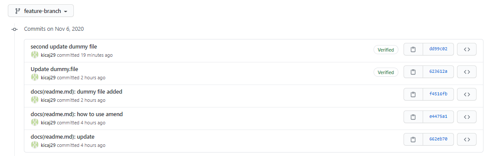
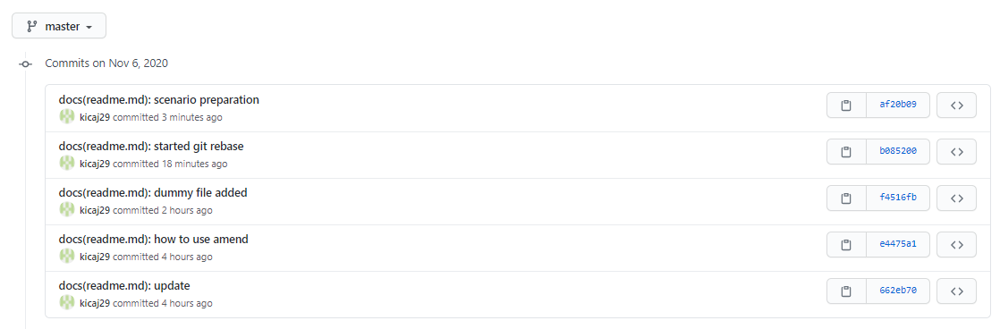

- [git-husky-commitlint](#git-husky-commitlint)
- [helpful commands](#helpful-commands)
  - [push changes from local repo to remote](#push-changes-from-local-repo-to-remote)
  - [revert last commit](#revert-last-commit)
  - [show last N commits](#show-last-n-commits)
  - [Squashing commits on local branch](#squashing-commits-on-local-branch)
  - [Squashing commits on remote branch](#squashing-commits-on-remote-branch)
  - [set author name and email](#set-author-name-and-email)
  - [edit git config files](#edit-git-config-files)
  - [change commit message in last local commit](#change-commit-message-in-last-local-commit)
  - [git cherry pick](#git-cherry-pick)
  - [git merge](#git-merge)
  - [git rebase](#git-rebase)
    - [Prepare scenario](#prepare-scenario)
    - [Make sure that local branch is up to date with remote](#make-sure-that-local-branch-is-up-to-date-with-remote)
    - [Checkout feature branch and run rebase on master](#checkout-feature-branch-and-run-rebase-on-master)
    - [Push changes to the remote feature branch](#push-changes-to-the-remote-feature-branch)
    - [Check commits history on remote branches](#check-commits-history-on-remote-branches)
    - [Branches tree](#branches-tree)
    - [No changes on master](#no-changes-on-master)
    - [Merge branch commit](#merge-branch-commit)
    - [another way](#another-way)
  - [git commit --amend](#git-commit---amend)
  - [undo all local not staged changes](#undo-all-local-not-staged-changes)
  - [checkout for Remote Branches](#checkout-for-remote-branches)
- [GitHub generate personal access token to get access to nuget packages](#github-generate-personal-access-token-to-get-access-to-nuget-packages)
- [resources](#resources)


# git-husky-commitlint
https://remarkablemark.org/blog/2019/05/29/git-husky-commitlint/   
https://commitlint.js.org/#/   
https://commitlint.io/   
https://github.com/angular/angular/blob/master/CONTRIBUTING.md#commit


Husky is a very popular npm package that allows custom scripts to be ran against your repository. It can be used to hook into typical git commands.

# helpful commands

## push changes from local repo to remote
git add .
git commit -m "sample message"
git push

## revert last commit
git reset --soft HEAD~1

## show last N commits
git log -n 5   
git log -n 2 origin/master

## Squashing commits on local branch
Sample:   
1. Create commit 1
```
git add .
git commit -m "feat(test): commit1"
```
check history:
```
PS D:\GitHub\kicaj29\git-sample> git log -n 1
commit d77621cbf8691ffc2a3205df356739b717406c16 (HEAD -> master)
Author: Jacek Kowalski <kicaj29@wp.pl>
Date:   Thu Jul 30 21:18:36 2020 +0200

    feat(test): commit1
```

2. Create commit 2
```
git add .
git commit -m "feat(test): commit2"
```
check history:
```
PS D:\GitHub\kicaj29\git-sample> git log -n 2
commit d47008029e955706d4edbc87ae8963d57d8ee6db (HEAD -> master)
Author: Jacek Kowalski <kicaj29@wp.pl>
Date:   Thu Jul 30 21:21:01 2020 +0200

    feat(test): commit2

commit d77621cbf8691ffc2a3205df356739b717406c16
Author: Jacek Kowalski <kicaj29@wp.pl>
Date:   Thu Jul 30 21:18:36 2020 +0200

    feat(test): commit1
```

3. Revert last 2 commits (your local changes will stay)
```
git reset --soft HEAD~2
```
check history (commit1 and commit2 are not there):
```
PS D:\GitHub\kicaj29\git-sample> git log -n 2
commit c9c9447b6ce510fcec9a5e028b53a0ad221a4dfb (HEAD -> master, origin/master, origin/HEAD)
Author: Jacek Kowalski <kicaj29@wp.pl>
Date:   Thu Jul 30 21:17:29 2020 +0200

    test(test): normal change

commit 33cd19c19450de621e08adf6e0cef0abe8c48f2b
Author: Jacek Kowalski <kicaj29@wp.pl>
Date:   Thu Jul 30 20:55:21 2020 +0200

    test(test): normal change
```

4. Commit local changes as one commit
```
git commit -m "feat(test): commit1 and commit2"
```
check history:
```
PS D:\GitHub\kicaj29\git-sample> git log -n 2
commit e1281151435f81cde3be0be59e8bc9769f7594ca (HEAD -> master)
Author: Jacek Kowalski <kicaj29@wp.pl>
Date:   Thu Jul 30 21:22:43 2020 +0200

    feat(test): commit1 and commit2

commit c9c9447b6ce510fcec9a5e028b53a0ad221a4dfb (origin/master, origin/HEAD)
Author: Jacek Kowalski <kicaj29@wp.pl>
Date:   Thu Jul 30 21:17:29 2020 +0200

    test(test): normal change
```

5. Now you can push the changes to remote branch.

## Squashing commits on remote branch

1. Create 3 local commits and push them to the remote branch

```
git add .
git commit -m "docs(readme.md): my commit1"
git push
```
```
git add .
git commit -m "docs(readme.md): my commit2"
git push
```
```
git add .
git commit -m "docs(readme.md): my commit3"
git push
```

check history on remote branch:
```
PS D:\GitHub\kicaj29\git-sample> git log -n 4 origin/master
commit 845bdbb275ef4caddc4eb31df41fbbc580ef41b8 (HEAD -> master, origin/master, origin/HEAD)
Author: Jacek Kowalski <kicaj29@wp>
Date:   Fri Jul 31 08:28:22 2020 +0200

    docs(readme.md): my commit3

commit 0fe6259c019c7771f948cc5699ec62f7a111b17f
Author: Jacek Kowalski <kicaj29@wp>
Date:   Fri Jul 31 08:10:22 2020 +0200

    docs(readme.md): my commit2

commit 2375c2364c0415fb76bd7b117b824a0d201449ad
Author: Jacek Kowalski <kicaj29@wp>
Date:   Fri Jul 31 08:05:31 2020 +0200

    docs(readme.md): my commit1

commit 874ab4824ab2d0a3860a11aa3108bf081337d068
Author: Jacek Kowalski <kicaj29@wp>
Date:   Thu Jul 30 21:35:48 2020 +0200

    docs(readme.md): how to do squashing on local branch
```


2. Squash commits locally with (to do it you cannot have any local changes)
```
git rebase -i origin/master~3 master
```

It will open GNU nano editor. Type squash for commit2 and commit3: 


Next press Ctrl+o to save the changes and press Enter to confirm it.


Next press Ctrl+x to close the file. It will open next editor:

   

Comment out commit 2 and 3 and update text for commit 1:


Save and close the changes: ctrl+o, enter, ctrl + x.

```
PS D:\GitHub\kicaj29\git-sample> git rebase -i origin/master~3 master
[detached HEAD 87320cf] docs(readme.md): example how to do squash for commits from remote branch
 Date: Fri Jul 31 08:05:31 2020 +0200
 Committer: Jacek Kowalski <kicaj29@wp.pl>
Your name and email address were configured automatically based
on your username and hostname. Please check that they are accurate.
You can suppress this message by setting them explicitly. Run the
following command and follow the instructions in your editor to edit
your configuration file:

    git config --global --edit

After doing this, you may fix the identity used for this commit with: 

    git commit --amend --reset-author

 2 files changed, 26 insertions(+), 3 deletions(-)
Successfully rebased and updated refs/heads/master.
```

check local barnch history, commits 1, 2, 3 are squashed into one new commit "docs(readme.md): example how to do squash for commits from remote branch":
```
PS D:\GitHub\kicaj29\git-sample> git log -n 3
commit 87320cff22ff065b3a61344dda5358711cb421c2 (HEAD -> master)
Author: Jacek Kowalski <kicaj29@wp.pl>
Date:   Fri Jul 31 08:05:31 2020 +0200

    docs(readme.md): example how to do squash for commits from remote branch

commit 874ab4824ab2d0a3860a11aa3108bf081337d068
Author: Jacek Kowalski <kicaj29@wp.pl>
Date:   Thu Jul 30 21:35:48 2020 +0200

    docs(readme.md): how to do squashing on local branch

commit e1281151435f81cde3be0be59e8bc9769f7594ca
Author: Jacek Kowalski <kicaj29@wp.pl>
Date:   Thu Jul 30 21:22:43 2020 +0200

    feat(test): commit1 and commit2
```

check history on remote branch, for now there are no changes on remote branch!:

```
PS D:\GitHub\kicaj29\git-sample> git log -n 3 origin/master
commit 845bdbb275ef4caddc4eb31df41fbbc580ef41b8 (origin/master, origin/HEAD)
Author: Jacek Kowalski <kicaj29@wp.pl>
Date:   Fri Jul 31 08:28:22 2020 +0200

    docs(readme.md): my commit3

commit 0fe6259c019c7771f948cc5699ec62f7a111b17f
Author: Jacek Kowalski <kicaj29@wp.pl>
Date:   Fri Jul 31 08:10:22 2020 +0200

    docs(readme.md): my commit2

commit 2375c2364c0415fb76bd7b117b824a0d201449ad
Author: Jacek Kowalski <kicaj29@wp.pl>
Date:   Fri Jul 31 08:05:31 2020 +0200

    docs(readme.md): my commit1
```

3. push the changes to the remote branch:

```
git push origin +master
```


## set author name and email
globally:
```
git config --global user.name "John Doe"
git config --global user.email "john@doe.org"
```
for selected repo (go to the repo folder and execute it):
```
git config user.name "John Doe"
git config user.email "john@doe.org"
```

## edit git config files
```
git config --system --edit
git config --global --edit
git config --local --edit
```
system - for all users   
global - for current user (it will overried system)   
local - for current repo (it will override global and system)   


## change commit message in last local commit
```
git commit --amend -m "New commit message."
```

## git cherry pick

Cherry pick and automatically create a local commit:
```
git cherry-pick [COMMIT-ID]
```

Cherry pick and do not automatically create a local commit:
```
git cherry-pick [COMMIT-ID] -n
```

## git merge

```
git fetch -p
git merge origin/main
```

## git rebase

### Prepare scenario

To present rebase we will use situation when we have feature branch with some commits and also we have some commits on master branch which do not exist on the feature branch - that`s why we need to rebase feature branch with master branch.

> NOTE: to create feature branch using https://github.com/ page create a commit and select that new branch should be created:

On the next screen you can cancel creation pull request because it is not needed in this case.


In the following screens we see that master branch contains commits that do not exist on the feature branch. After rebase these commit will be available on the feature branch!



### Make sure that local branch is up to date with remote

```
git pull
```

### Checkout feature branch and run rebase on master

**Because we did not have any conflicts there was no merge conflict step.**


### Push changes to the remote feature branch

```
git push --force-with-lease
```
In case there are changes in the remote repository push will be aborted!


### Check commits history on remote branches

We can see that new commits from the master branch appeared in the feature branch!


### Branches tree


### No changes on master


### Merge branch commit

Merge branch commit does not contain any changes, it only informs about the merge which in practice in this case we a rebase!


### another way

```git pull --rebase origin develop```


NOTE: if there are merge conflicts resolve them and next run

```git add .```   
```git rebase --continue```   
```git push -f```

> NOTE: press ESC and type `:wq` in the vi editor if you resolved some conflicts in rebase

[git pull --rebase vs git rebase](https://stackoverflow.com/questions/38017517/git-pull-rebase-vs-git-rebase-whats-the-dangergit)

## git commit --amend

The git commit --amend command is a convenient way to modify the most recent commit. It also allows add some additional changes and not only modify existing commit message.

```
git add .
git commit --amend
[here new window with commit message will appear]
git push --force-with-lease
```

Another version:
```
git commit --amend --no-edit
```

## undo all local not staged changes

```
git checkout .
```

## checkout for Remote Branches

The syntax for making git checkout "remote-ready" is rather easy: simply add the "--track" flag and the remote branch's ref like in the following example:

```
git checkout --track origin/newsletter
```
# GitHub generate personal access token to get access to nuget packages

* Go to `Developer settings`


* Next go to `Tokens (classic)` and generate the token. If needed configure SSO with your organization


Make sure that you set correct permission for the generated tokens.


* Next go to local machine C:\Users\[USR]\AppData\Roaming\NuGet\NuGet.Config and add the following section

https://docs.github.com/en/packages/working-with-a-github-packages-registry/working-with-the-nuget-registry#authenticating-with-a-personal-access-token

```xml
<configuration>
    <packageSources>
        <clear />
        <add key="github" value="https://nuget.pkg.github.com/NAMESPACE/index.json" />
    </packageSources>
    <packageSourceCredentials>
        <github>
            <add key="Username" value="USERNAME" />
            <add key="ClearTextPassword" value="TOKEN" />
        </github>
    </packageSourceCredentials>
</configuration>
```

Set user to your github account and in the `ClearTextPassword` set the generated token. Now you should be able to download nuget packages -
also from selected organizations if SSO option has been selected. **Make sure that you change NAMESPACE in the url to the name used by your organization.**

# resources
[Keeping Feature Branches Up To Date With Rebasing | Git Workflows](https://www.youtube.com/watch?v=dqVqMwLzOjU)   
[git rebase](https://www.youtube.com/watch?v=f1wnYdLEpgI)   
https://www.atlassian.com/git/tutorials/rewriting-history   
https://www.git-tower.com/learn/git/faq/checkout-remote-branch   